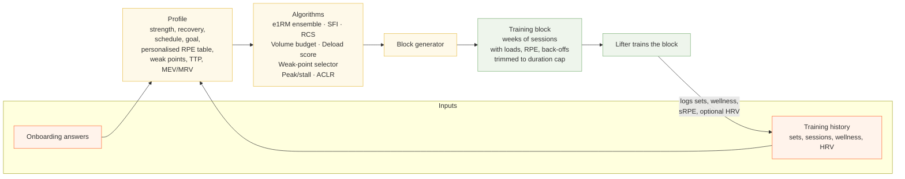
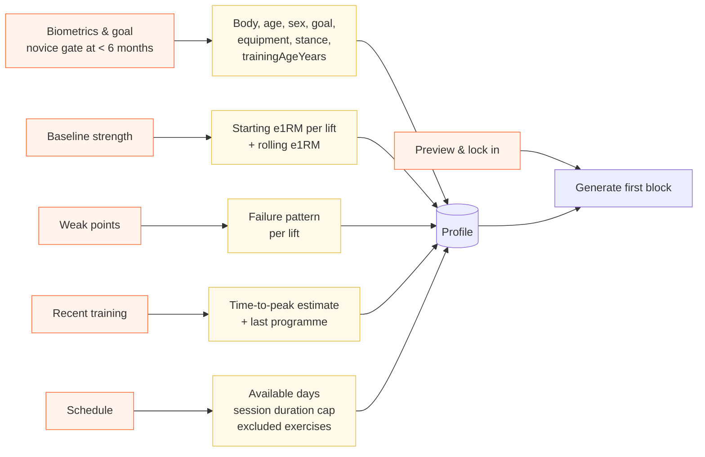
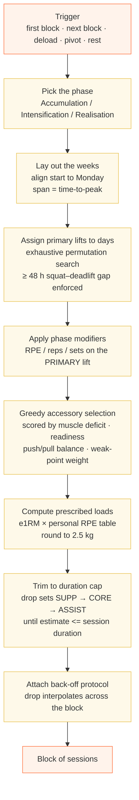
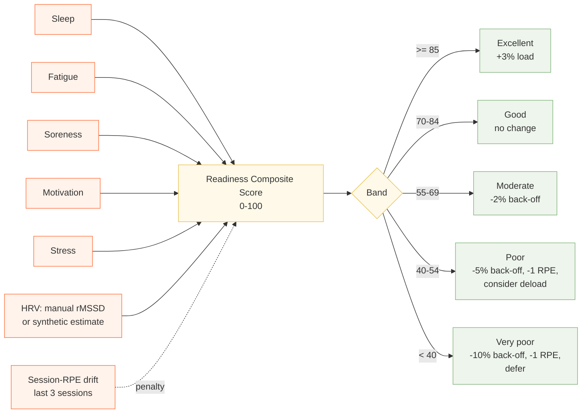
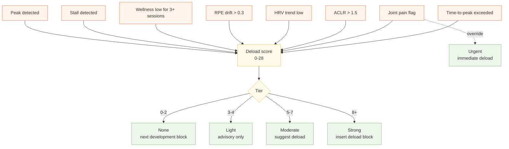
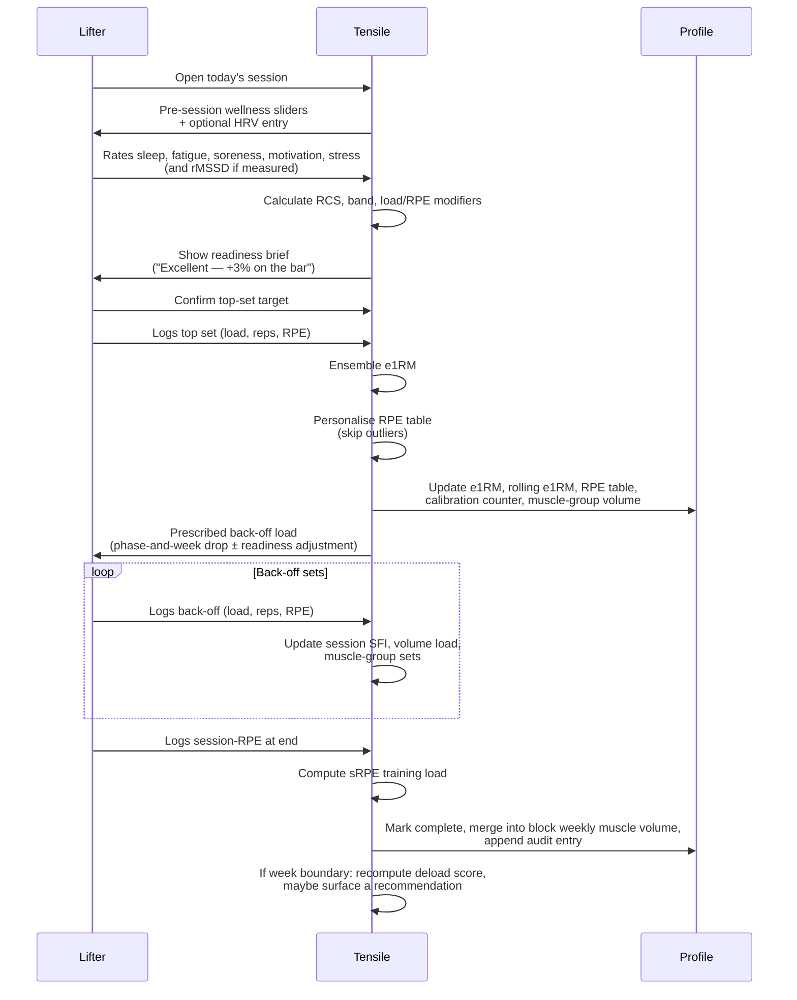
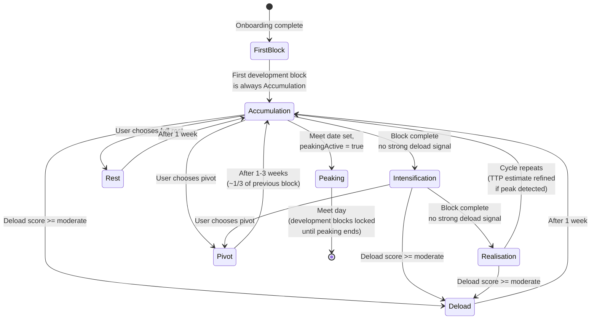

# How Tensile generates a training program

*Audience: product and coaching reviewers.*
*Scope: the full pipeline from the user's first onboarding answer to the next block the app puts in front of them.*

---

## 1. Overview

Tensile builds a training program in three stable layers that feed each other on a loop.

1. **The profile** — what the app knows about the lifter. Created during onboarding, then continuously refined by every set, every session, and every block the lifter logs. It holds biometrics, goal, equipment, available days, the lifter's personalised RPE-to-percentage table, current and rolling estimated 1RMs, MEV/MRV per muscle group, weak points, HRV baseline, an optional load-velocity profile, and a time-to-peak estimate that updates after each block.
2. **The algorithms** — a small set of fixed rules that score readiness, estimate strength, measure fatigue, choose accessories, adjust loads, and decide when to push, hold, or deload.
3. **The block generator** — composes the above into a multi-week training block of concrete sessions. Each session is a list of exercises with prescribed sets, reps, RPE targets, and *bar loads*, and is built to fit the lifter's session-duration cap.

The lifter then trains that block. Every set updates the profile in five ways at once: the lift's e1RM moves, the rolling average moves, the lifter's personal RPE table drifts toward observed performance, the session's per-muscle-group volume accumulates, and the RPE-calibration counter ticks up. At the end of each session the wellness score, session RPE, and training load are stored; at the end of each week a deload score is recomputed; at the end of each block, peak detection refines the time-to-peak estimate and accessory-to-lift correlations are computed.

The program isn't a fixed plan handed down once — it's the steady output of a feedback loop.

*Diagram 1 — the closed loop. Inputs feed the profile, the profile feeds the algorithms, the algorithms feed the generator, the generated block is trained, and training produces new history that updates the profile.*

All state is stored client-side in IndexedDB (with a localStorage fallback and a one-time migration from older builds), so the app works offline.

---

## 2. What the user tells the app (onboarding)

Onboarding is six screens. Each one writes a specific slice of the profile, which is the only thing the generator reads later.

- **Biometrics & goal** — body weight, date of birth, sex, height, training age, primary goal (Powerlifting, Strength, Hypertrophy, General), squat stance, deadlift stance, whether they use a belt, and what they wear on their knees (raw, sleeves, wraps).

  Training age is gated: lifters with less than 6 months under the bar are politely turned away with a notice that Tensile assumes reliable RPE reporting, which true novices can't yet provide. The lifter is invited back when they hit 6 months. Beginners in the 6–12 month band are accepted but flagged for fresh RPE calibration (their starting RPE confidence is treated as untrusted until they've logged 10+ sessions).
- **Baseline strength** — for squat, bench, and deadlift the lifter enters a recent heavy set as weight × reps × RPE. The app converts these into estimated one-rep maxes using the same ensemble algorithm it will use forever after, so the very first prescribed loads are already in the lifter's actual ballpark.
- **Weak points** — for each main lift, the lifter picks the failure pattern they want to fix (for example, *out of the hole* on squat, *off the chest* on bench, *off the floor* on deadlift). These directly drive the weak-point engine in Section 4, which biases accessory selection toward exercises tagged for that failure pattern.
- **Recent training history** — what programme they were on most recently (nSuns, Sheiko, 5/3/1, Custom RPE, etc.) and a derived time-to-peak estimate that comes from their training age (a longer-tenured lifter peaks in a longer development block than a one-year lifter).
- **Schedule & equipment** — which days of the week they can train (a 7-toggle grid), how long a session should be (45, 60, 75, 90 minutes), and any exercises they want excluded (injury, no equipment, dislike). The duration figure is real — the generator trims sets to fit it (see Section 4).
- **First block preview** — the lifter sees the block the system will generate and locks it in.

*Diagram 2 — onboarding screens on the left, the profile fields they populate on the right. Locking in at the end triggers the first block generation.*

A separate, optional screen — VBT Calibration — lets a lifter who has a bar-speed sensor enter two or more load + measured-velocity pairs. The app fits a load-velocity regression, stores the slope, intercept, R², and sample size in the profile, and from then on uses the third (velocity-based) estimator in the e1RM ensemble.

---

## 3. What the app remembers from training

Once the lifter is training, the app captures five kinds of data, each of which flows back into the profile.

1. **Pre-session wellness** — five sliders (sleep quality, fatigue, soreness, motivation, stress) and an optional manual HRV entry (morning rMSSD in ms). These feed the Readiness Composite Score for the session.
2. **Set logs** — for every working set: prescribed and actual load, prescribed and actual reps, the lifter's reported RPE, optionally bar-speed velocity. Each set immediately:
   - Recomputes the lift's session-level e1RM via the ensemble.
   - Folds that into the lifter's rolling e1RM.
   - Nudges the lifter's *personal* RPE-to-percentage table toward what was actually observed (unless the set was flagged as an outlier — see Section 6.2).
   - Adds one working set to the session's per-muscle-group volume tally.
   - Increments the RPE-calibration counter on the profile.
3. **Session totals** — total volume load (weight × reps across every set), total Session Fatigue Index, and at session end a session-RPE plus an *sRPE training load* (sRPE × estimated session minutes).
4. **Status & overrides** — was the session completed, skipped, or partial? Every manual adjustment (lower the RPE cap, drop a set, defer, reactive deload) is recorded as a string in the session's `overrides` list. RPE outliers are auto-logged here too.
5. **Block-level rollups** — at the end of each session, that session's muscle-group set counts are merged into the block's weekly muscle-volume map. A separate `auditLog` on the block records every system decision (week completed, phase changed, etc.) with an evidence tier (`VALIDATED`, `HEURISTIC`, or `SYSTEM`), so coaches can review what the engine did and why.

The profile fields that get continuously updated by all this are:

- **Current e1RM** and **rolling e1RM** per lift.
- **Personalised RPE table** — the lifter's own `{reps}@{rpe} → percentage` map, drifting toward their observed performance; flagged "personalised" once 20+ entries have moved away from the population defaults.
- **RPE calibration** — total sessions logged, plus mean absolute error of RPE predictions.
- **HRV history** (last 28 readings) and **28-day baseline** — recomputed every time a real reading is entered.
- **Time-to-peak estimate** and **TTP history** — refined when a peak is detected at block end.
- **Accessory responsiveness** — Pearson correlation between an accessory's weekly volume and the parent lift's weekly e1RM, computed when a development block ends and a meaningful correlation (|r| > 0.4) is found across at least six paired weeks.

Everything persists to IndexedDB, with localStorage as a redundant backup. There is no server.

---

## 4. How a block is built

When the lifter is ready for a new block, the generator runs a single pass through seven stages.

*Diagram 3 — the generator's seven-step pass. Every block type uses the same pipeline; the difference between a development block and a deload is in which modifiers get applied at steps 4, 5, 7, and 8.*

**Step 1 — pick the phase.** Development blocks cycle through three phases in order: Accumulation (build volume at moderate RPE), Intensification (less volume, heavier loads), Realisation (peaking with the heaviest, fewest, highest-RPE work). The generator keeps a counter of how many blocks the lifter has completed and picks the next phase by stepping through the cycle. Deload, Pivot, Rest, and Peaking are separate block types with their own modifiers. If a peaking plan is active (the lifter has set a meet date and started peaking), new development blocks are locked until peaking ends.

**Step 2 — lay out the weeks.** The start date is snapped to the most recent Monday so weekday-tagged sessions land on the right day. The block spans the lifter's current time-to-peak estimate (default 6 weeks, but the engine refines this — see 6.6).

**Step 3 — assign primary lifts to days.** For every week, the engine runs an exhaustive permutation search over the lifter's available days and every valid assignment of squat, bench, and deadlift to those days. A hard constraint rules out any assignment where squat and deadlift fall within 48 hours of each other. Among valid assignments, the search scores each option: a squat–deadlift gap in the 48–96-hour sweet spot earns a bonus, sessions that alternate upper and lower body earn a bonus, and bench days spaced too close together lose a point. The highest-scoring valid assignment is used. If fewer than three days are available, one or more primary lifts are assigned `null` (that day becomes accessory-only or GPP). With that lift-to-day assignment fixed, `buildProgrammaticSession` fills each day — see Section 5.

**Step 4 — apply phase modifiers.** The PRIMARY lift in each session is adjusted relative to its Accumulation baseline:

| Phase            | RPE target      | Reps          | Sets          |
| ---------------- | --------------- | ------------- | ------------- |
| Accumulation     | baseline        | baseline      | baseline      |
| Intensification  | **+0.5**        | **−1**        | unchanged     |
| Realisation      | **+1.0**        | **−1**        | **−1**        |

**Step 5 — greedy accessory selection.** After the PRIMARY lift is placed, the engine scores every exercise in the catalog (except PRIMARY and CORE tag exercises) against the session context and greedily adds exercises one by one until either the SFI budget or the duration cap is exhausted.

The score for each candidate is a product of several factors:

1. **Muscle deficit** — the sum of positive deficits (`weeklyTarget − setsSoFar`) for the exercise's primary muscles. Exercises that address the muscles most behind on their weekly MEV/MRV target score highest.
2. **Muscle readiness** — each muscle group's recovery state is estimated with exponential fatigue decay: `readiness = 1 − exp(−hoursSince/halfLife) × min(1, fatigueLoad/10)`. The half-life is chosen from the exercise's EFC (≥ 1.25 → 60 h, ≥ 0.70 → 48 h, else → 36 h), and is reduced by up to 20% for experienced lifters who recover faster. Any exercise whose primary muscle has readiness below 0.4 is hard-excluded for that session.
3. **Push/pull balance** — the engine tracks a `pushPullTargetRatio` (default 1:1) across each session. If the session's push:pull ratio is already more than 1.5× the target and the candidate is a push exercise, its score is halved; if the ratio is less than 0.67× and the candidate is a pull, the score gets a 30% bonus.
4. **Weak-point priority** — exercises whose `weakPointTargets` match the lifter's declared failure pattern keep the same 1.5× priority factor as before; highly persistent weak points can push this up to 2.5×.
5. **Accessory responsiveness** — if the lifter has a stored Spearman correlation above 0.4 for this exercise (from a prior block), the score is multiplied by `1 + ρ`.

Two guarantees are enforced after scoring: at least one CORE exercise is always added, and if the session contains at least one push exercise but no pull exercise, the highest-scored pull is force-added regardless of budget. There are no longer fixed ASSIST/SUPP slots — exercises are simply added in score order until the session is full.

The WeekContext threads the accumulated sets per muscle group and movement-pattern counts forward from the first session of the week to the last, so Monday's volume is visible when Tuesday's exercises are scored, and so on.

**Step 6 — compute prescribed loads.** For each main lift, the generator takes the lifter's current e1RM, looks the target reps and RPE up in the lifter's *personal* RPE-to-percentage table (which starts as the published Tuchscherer/Helms population values but drifts toward observed performance over time), multiplies, and rounds to the nearest 2.5 kg plate. Accessory exercises also get a prescribed load, but as a fixed fraction of the related main lift's percentage (assists at roughly 75% of the primary load, supps at roughly 60–70%).

**Step 7 — SFI and duration budget.** Rather than trimming after the fact, the session duration and fatigue budgets are enforced *during* the greedy selection in Step 5. Before adding each candidate exercise, the engine projects the new aggregate SFI and the new estimated session duration (warmup + working sets + RPE-scaled rest periods). If either limit would be exceeded, the candidate is skipped. The session is flagged `durationTrimmed: true` if any exercise was excluded for this reason, keeping the block-review advisory intact.

**Step 8 — attach a back-off protocol.** After the top set, the lifter does back-off sets at a reduced load, repeating until their RPE rises to the prescribed target. The drop size now depends on both the phase *and the block week*: in Accumulation it interpolates linearly from 10% in week 1 up to 15% in the final week (more dropdown volume as the lifter is moving more weight); in Intensification it goes 5% → 8%; in Realisation it stays a flat 2% (the goal there is heavy practice, not volume).

---

## 5. Session structure and exercise selection

Every session is anchored by one primary lift (or no primary lift on accessory-only days). The surrounding exercises are chosen programmatically by the scoring system described in Section 4, Step 5.

### Movement pattern taxonomy

The catalog tags every exercise with a `movementPattern` that the scheduler uses to enforce push/pull balance within sessions and across the week:

| Pattern | Examples |
|---|---|
| `squat` | Back squat, front squat, goblet squat, leg press, box squat |
| `hip_hinge` | Conventional DL, sumo DL, RDL, good morning, deficit DL |
| `horizontal_push` | Bench press, close-grip bench, incline press, dumbbell bench |
| `horizontal_pull` | Barbell row, cable row, chest-supported row, dumbbell row |
| `vertical_push` | Overhead press, landmine press, push press |
| `vertical_pull` | Lat pulldown, pull-up, chin-up, cable pullover |
| `isolation_push` | Tricep pushdown, lateral raise, pec deck, cable fly |
| `isolation_pull` | Dumbbell curl, face pull, rear delt fly, hammer curl |
| `isolation_lower` | Leg curl, leg extension, calf raise, hip thrust |
| `carry` | Farmer's walk, yoke carry |
| `core` | Plank, ab wheel, dead bug, Pallof press |

The engine aggregates push-pattern exercises (`horizontal_push`, `vertical_push`, `isolation_push`) and pull-pattern exercises (`horizontal_pull`, `vertical_pull`, `isolation_pull`) and steers the session toward a 1:1 ratio (configurable via `pushPullTargetRatio` in EngineConstants).

### Typical session shape

While there are no fixed exercise slots, a typical 4-day session will end up looking roughly like this — an emergent product of the scoring system, not a template:

**Squat day** — squat primary + 1–2 lower accessories (scored by quad/hamstring/glute deficit) + 1–2 upper accessories (pull pattern, scored by upper-body deficits built up earlier in the week) + core.

**Bench day** — bench primary + horizontal/vertical pull (pull-pattern balance) + isolation work for pecs/triceps/delts + core.

**Deadlift day** — deadlift primary + lower accessories (hamstrings, glutes) + upper pull accessories + core.

**Extra day (4th training day)** — no primary lift; scored entirely by which muscle groups are most behind on their weekly targets.

### Weak-point bias

Weak-point targeting is no longer a post-hoc slot swap. The scoring system applies a 1.5–2.5× multiplier to any exercise whose `weakPointTargets` matches the lifter's declared failure pattern, making those exercises consistently win the greedy selection when they are relevant. The catalog still contains the same ~70+ targeted variations:

- *Squat, "out of the hole"* → paused squat, box squat, heel-elevated squat, safety-bar squat.
- *Bench, "off the chest"* → paused bench, Spoto press.
- *Deadlift, "off the floor"* → deficit deadlift, snatch-grip deadlift, good morning.

**What the exercise tags mean:**

- **PRIMARY** — the heavy main lift; the only tag that responds to phase RPE/reps/sets modifiers and direct e1RM-based load prescription.
- **ASSIST** — strength variation of the primary, biased to the weak point (now selected by score, not a fixed slot).
- **SUPP** — supplemental hypertrophy work (now selected by score against muscle deficits).
- **CORE** — trunk work; always guaranteed at least one per session.

The lifter can still exclude individual exercises (persisted to the profile) and add custom exercises through the catalog screen.

---

## 6. The algorithms, explained

Each algorithm is a small, deterministic rule. There are no opaque models; every decision the app makes can be explained and is logged to the block's audit log.

### 6.1 Ensemble e1RM — *how strong is the lifter right now?*

**What it asks:** What is the lifter's true one-rep max, given the latest heavy set they reported?

**What it uses:** Three independent estimates from the same set, weighted by how trustworthy each is for that set:

1. **Rep-based** — Epley and Brzycki formulas averaged together. Confident for low-rep, high-RPE sets; weaker for long sets where rep-prediction formulas break down.
2. **RPE-adjusted** — looks the lifter's reps + RPE combination up in their *personal* RPE table (see 6.2) and divides the load by that percentage. Confidence grows with logged sessions and with the lifter's training age:
   - 20+ sessions and mean RPE error ≤ 0.5 → full confidence.
   - 10+ sessions → high confidence.
   - 2+ years training age → moderate confidence (so an experienced lifter is trusted from day one).
   - Otherwise → low confidence.
3. **Velocity-based** (optional) — if a bar-speed sensor is connected and the lifter has fitted a load-velocity profile on the VBT Calibration screen, this becomes the most precise method, with confidence scaling up as more calibration points accumulate.

The three estimates are blended by confidence-weighted average. The single-session estimate is then folded into the rolling e1RM via an exponential moving average where the newest session is weighted at 30% — recent performance moves the needle quickly, but a single bad day doesn't wipe out months of progress.

**What it changes:** Every prescribed top-set load in every future session.

### 6.2 RPE-to-percentage table — *how heavy is "3 reps at RPE 8.5"?*

Tensile starts each lifter with the published Tuchscherer/Helms population values: for example, 3 reps at RPE 8.5 is 85% of 1RM; 5 reps at RPE 9 is 82%; 1 rep at RPE 10 is 96%.

But the table is not fixed — it personalises. After every logged set, the app:

1. Computes the *observed* percentage as load ÷ session e1RM.
2. Compares that against the table's expected value for the same reps+RPE.
3. If the observed value is within 15% of the expected value, the table entry is nudged toward the observed value (exponentially weighted, with the new observation getting 10% weight).
4. If the observed value is *more* than 15% off, the set is flagged as an **RPE outlier**, not used to update the table, and recorded as an override in the session log — so coaches can see that the lifter either misreported their RPE or had an unusually good or bad day.

Once 20 or more entries have drifted measurably away from the population defaults, the table is marked "personalised" and the lifter sees a badge to that effect.

The same table is used both forwards (to prescribe load from a target RPE and reps in the block generator) and backwards (inside the e1RM ensemble in 6.1).

### 6.3 Session Fatigue Index — *how costly was that set?*

**What it asks:** How much fatigue did this set contribute to the session?

**What it uses:** The set's RPE (higher RPE means closer to failure, more fatigue), reps (more reps means more total stress), an exercise-specific fatigue coefficient (a heavy squat at the same RPE is harder to recover from than a cable row at the same RPE), and a top-set bonus of 1.2× because top sets cost more than back-offs.

The exercise fatigue coefficient (EFC) table covers roughly 70 movements grouped by class. A rough sense:

| Movement class                                       | Coefficient |
| ---------------------------------------------------- | ----------- |
| Heavy squat variations (back, front, paused, SSB)    | ~1.40       |
| Conventional / sumo / trap-bar / deficit deadlift    | ~1.35       |
| RDL / good morning / snatch-grip / rack pull         | 1.25 – 1.30 |
| Overhead press                                       | 1.00        |
| Bench variations (bench, close-grip, incline)        | 0.85 – 0.95 |
| Rows and pulldowns                                   | 0.85        |
| Hip thrust / leg press / hack squat                  | 0.75        |
| Lunges / split squats / single-leg work              | 0.80 – 0.85 |
| Curls, pushdowns, lateral raises, face pulls         | 0.50 – 0.55 |
| Leg curl / leg extension / calf raise                | 0.50        |
| Core (plank, pallof, dead bug)                       | 0.20 – 0.40 |

**What it changes:** The session SFI is the sum across all sets; the per-week trend feeds both ACLR (6.7) and deload detection (6.8).

### 6.4 Readiness Composite Score (RCS) — *how prepared is the lifter today?*

**What it asks:** Given how the lifter is feeling, should we lighten the day, leave it alone, or push it slightly?

**What it uses:** The five wellness sliders, weighted because sleep and fatigue matter more than motivation and stress:

| Slider          | Weight |
| --------------- | ------ |
| Sleep quality   | 1.20   |
| Overall fatigue | 1.15   |
| Muscle soreness | 1.00   |
| Motivation      | 0.85   |
| Stress          | 0.80   |

Their weighted average is normalised to 0–100. HRV nudges the score by up to ±15 points down or +10 points up, in proportion to how far the latest reading deviates from the 28-day baseline. If the lifter actually enters an rMSSD reading, that is used; otherwise the engine derives a synthetic estimate from the wellness composite so the score keeps moving even without a sensor. A creeping rise in session-RPE across the last three sessions — a sign of accumulating fatigue even if the lifter feels okay — pulls the score down by up to 15 points.

**What it changes:** The score gets mapped to a band, and each band applies prescribed adjustments to that day's session:

| Band       | RCS    | What changes                                              |
| ---------- | ------ | --------------------------------------------------------- |
| Excellent  | ≥ 85   | Top-set load +3%, back-off load +3%                       |
| Good       | 70–84  | No change                                                 |
| Moderate   | 55–69  | Back-off load −2%                                         |
| Poor       | 40–54  | Back-off load −5%, RPE cap −1, *consider deload*          |
| Very poor  | < 40   | Back-off load −10%, RPE cap −1, *defer session if possible* |

*Diagram 5 — the readiness pipeline. Five sliders plus HRV (real or estimated) and a fatigue-drift penalty produce a score, which lands in one of five bands, each prescribing a specific load and RPE adjustment for the day.*

### 6.5 Volume budget — *how many working sets per muscle group this week?*

**What it asks:** Given where we are in the block, how many working sets should each muscle group accumulate this week?

**What it uses:** A minimum effective volume (MEV) and maximum recoverable volume (MRV) per muscle group — for example, quads might be MEV 10 / MRV 22 sets per week. The week's target rises linearly from MEV in week 1 to MRV in the final week. If readiness is sustained low the target shrinks by 10%; if it's excellent it grows by 5% (capped just below MRV).

**What it changes:** The per-muscle weekly target now *drives session generation directly* — `computeWeeklyMuscleTargets()` calls `volumeBudget()` for each muscle at the start of every microcycle, and the resulting targets feed into the exercise scoring system (Step 5), making exercises that address under-served muscles score higher. Volume also shows up in the block review as a per-muscle-group bar chart with MEV / MAV / MRV landmarks, fed by the per-session muscle-group tallies the logging pipeline accumulates into the block's `weeklyMuscleVolume` map.

### 6.6 Peak and stall detection — *is progress real, or is the lifter cooked?*

**What it asks:** Has the lifter's e1RM trend peaked (gone up, then started declining for two straight weeks) or stalled (flatlined for several weeks)?

**What it uses:** The week-by-week best estimated 1RM across completed sessions in the current block. A peak is declared when the maximum value happened at least two weeks before the end, *both* of the last two weeks are declining, and progress was actually made above the starting value. A stall is declared after week 3 if the slope across the last three weeks is essentially flat and the lifter hasn't built more than 1% above their starting e1RM.

**What it changes:** Both signals contribute to the deload score (6.8). In addition, when a peak is detected at the *end* of a development block, the week the peak landed on is appended to the lifter's TTP history.

The TTP estimate update is then **gated by a two-block confirmation rule**. A single off-target peak — caused by a week of poor sleep, illness, or unusual stress — should not durably shrink or stretch the next block. So the first off-target peak is recorded as a *pending candidate* and the estimate is held. If the next block's peak lands in the same direction (both earlier or both later than the current estimate) and within ±1 week of the candidate, the gate fires: the EWMA (α = 0.4) is applied across both observations in chronological order and the estimate moves. If the next peak is on-target or contradicts the candidate (different direction or jumps >1 wk), the candidate is discarded and the estimate stays put. Every transition — `TTP_CANDIDATE_RECORDED`, `TTP_ESTIMATE_UPDATED`, `TTP_CANDIDATE_CLEARED`, `TTP_CANDIDATE_REPLACED` — is written to the block's audit log so the lifter can see why their next block was the length it was.

So a lifter who consistently peaks at week 5 will, after **two** consecutive 5-week peaks, see Tensile generate ~5-week blocks instead of the default 6-week ones; a one-off early peak from a bad-sleep week does not shrink the next block.

### 6.7 ACLR (Acute-Chronic Load Ratio) — *is fatigue spiking?*

**What it asks:** Is recent training load running disproportionately ahead of the lifter's recent baseline?

**What it uses:** An **EWMA acute:chronic ratio** over daily sRPE-load (Williams et al. 2017), falling back to Session Fatigue Index when sRPE wasn't logged. The acute EWMA uses λ ≈ 0.25 (7-day half-life); the chronic EWMA uses λ ≈ 0.069 (28-day half-life). Days without sessions contribute 0 — the decay continues so the chronic baseline doesn't get artificially flattered by rest weeks. ACLR > 1.5 means recent training load is running more than 50% above the 28-day-weighted chronic baseline.

For the first 14 days of training history the chronic baseline is immature; the system shows the chart as *calibrating* rather than emitting a false warning. This — combined with the EWMA's exponential decay — is what stops the programmed volume drop between Accumulation and Realisation from triggering the warning, which the old week-over-week ratio could not avoid.

**What it changes:** It does not modify the prescription directly, but the block review surfaces an amber warning when any week's ACLR exceeds 1.5, the deload score adds 1 point when the flag is on, and the warning is logged to the block's audit log.

### 6.8 Deload score — *is it time to back off?*

**What it asks:** Should the next block be a development block, or do we need a deload first?

**What it uses:** Eight independent signals, each contributing a weight to the score:

| Signal                                | Weight | What it means                                          |
| ------------------------------------- | ------ | ------------------------------------------------------ |
| Peak detected                         | 5      | e1RM trend has clearly turned over                     |
| Joint pain flag                       | 5      | Sustained low soreness response signals an issue       |
| Stall detected                        | 4      | Strength gains have flatlined for three weeks          |
| Sustained low wellness                | 4      | Average RCS over the last 3 sessions is below 60       |
| Time-to-peak exceeded                 | 4      | Block has run past 1.3× the lifter's TTP estimate      |
| RPE drift                             | 3      | Last 3 sessions feel ≥ 0.3 RPE harder than the first 3 |
| Low HRV trend                         | 2      | HRV running below 28-day baseline                      |
| ACLR elevated                         | 1      | Recent SFI > 1.5× earlier baseline                     |

The weights add up to 28. The score is recalculated automatically at the end of each training week — the moment the last session in the current week is marked complete, the engine inspects e1RM trends, the recent RCS average, and the TTP counter, computes the score, and surfaces a recommendation tier in the app:

| Score    | Tier      | What the app suggests                                                  |
| -------- | --------- | ---------------------------------------------------------------------- |
| 0–2      | None      | Carry on into the next development block                               |
| 3–4      | Light     | Carry on, but the advisory is logged in the block review               |
| 5–7      | Moderate  | Suggest a deload — monitor recovery closely if the lifter declines     |
| 8+       | Strong    | Strong recommendation: insert a deload block before the next dev block |
| any score, *but joint pain on* | Urgent | Override — recommend an immediate deload regardless of score, and suggest seeing a physio |

*Diagram 6 — the deload decision. Eight signals contribute weighted points to the score; the score lands in a tier; the tier picks the next block type. The joint-pain flag is a hard override that escalates straight to "urgent" no matter what the rest of the signals say.*

### 6.9 Accessory responsiveness — *which accessories are actually moving the needle?*

**What it asks:** Of the assists and supps the lifter has been doing, which are correlated with progress on the main lift?

**What it uses:** At the end of every development block, for each accessory the lifter logged at least six weeks of: the Pearson correlation between that accessory's weekly volume load and the parent lift's weekly best e1RM.

**What it changes:** Any Spearman correlation with |ρ| > 0.4 is stored on the profile. These correlations now feed directly into exercise scoring: a responsive accessory earns a `1 + ρ` multiplier in the greedy selection, making it more likely to appear in future sessions (Section 4, Step 5). Results also show up in the Weak Point block-review screen so coaches and the lifter can see which accessories are pulling their weight.

### 6.10 Session duration estimator — *will the workout fit in the time the lifter has?*

A small but important rule. The estimator adds 15 minutes for warmup plus, for every set, 0.75 minutes of work plus a rest period scaled to RPE (4 min at RPE 8+, 2.5 min at RPE 7+, 1.75 min otherwise). If the total exceeds the lifter's session-duration cap, the generator drops sets one at a time, starting from the lowest-priority slot (SUPP, then CORE, then ASSIST), and flags the session as `durationTrimmed: true` so the block review can show it.

---

## 7. Readiness and in-session adjustments

The block as generated is not what the lifter necessarily lifts. The readiness step happens at session start, after the block is already in place, and tweaks the day's prescription on the fly.

*Diagram 7 — one session, from arriving at the gym to walking out. The pre-session wellness check shifts the prescribed loads before the lifter touches the bar; every logged set updates the profile in place; the session-RPE at the end becomes one of the inputs to next block's deload decision; and a week boundary triggers an automatic deload-score recompute.*

If the lifter wants to override anything — drop a set, lower the RPE cap, defer the session, reactive deload — the override is recorded as a string on the session and surfaces in both the block-readiness review (counts of reductions vs. bumps) and the audit log (full chronological list).

---

## 8. The block lifecycle

A Tensile lifter is always in exactly one block. Blocks come in five types, with rules for moving between them.

*Diagram 8 — the block lifecycle. Development cycles through three phases. Deload, Pivot, and Rest are detours back to Accumulation. When a meet date is set and peaking begins, development is locked until the meet is over.*

**First block.** Built at the moment the lifter locks in onboarding. Always starts in Accumulation.

**Development cycle.** After a block finishes, the system increments the completed-blocks counter and picks the next phase by stepping through *Accumulation → Intensification → Realisation → Accumulation → …*. Three blocks make a full mesocycle. As part of this transition the engine looks at the previous block's e1RM trends — if a peak was detected, the peak week is added to TTP history and the next block is scaled to the lifter's updated time-to-peak estimate.

**Deload block.** One week long. Built by taking what the next development block would have been, keeping only the first seven days, halving the sets on every exercise, capping the RPE target at 7.0, and for the PRIMARY lift increasing reps by one (capped at 5) to keep the bar moving with cleaner technique at lighter loads.

**Pivot block.** Variable length — roughly one third of the preceding block's duration, clamped between 1 and 3 weeks. Used when the lifter wants to shift focus or break a stall without a full deload. Competition lifts (back squat, bench, conventional deadlift, close-grip bench) are swapped for variation movements (paused squat, paused bench, deficit deadlift, incline press); RPE is capped at 8.0; rep minimums rise to 6. The first week's template is then duplicated forward to fill the pivot duration.

**Rest block.** One week of nothing. No sessions. Used when the lifter is sick, travelling, or just needs a complete break.

**Peaking block.** Triggered when the lifter sets a meet date. The system works backwards from the meet:

- **3 days before meet day:** Taper starts (very light openers and singles).
- **3 weeks before meet day:** Realisation starts (the last two weeks of heavy single-digit-rep work, then the taper).
- **2–3 weeks earlier still:** Pivot starts (pivot length scales to roughly one third of the lifter's TTP).
- **Earlier than that:** Development starts.

The system also reports whether the timeline is feasible; if not, it flags the schedule and asks the lifter to either move the meet or accept a compressed plan. While peaking is active, development block generation is locked — the lifter follows the peaking timeline through to meet day.

---

## 9. The closed feedback loop

Pulling it all together — every logged set is also an input to the next block.

- A heavy top set logged today → the **ensemble e1RM** updates → the **rolling e1RM** drifts in the direction of recent performance → the next top-set prescribed load reflects the change. The same set also nudges the lifter's **personal RPE table** toward the observed load-to-1RM ratio (unless it was an outlier), so prescribed loads sharpen over time.
- A streak of weeks where the e1RM trend rises, peaks, then declines for two straight weeks → **peak detection** fires → at block end, the peak week joins the **TTP history**, the lifter's time-to-peak estimate is refined via EWMA, and the *next* generated block uses the new duration.
- A run of sessions where the lifter rates them progressively harder → **session-RPE drift** is detected → the **RCS** for the next session takes a penalty → that session's prescribed back-off load drops → and the drift also contributes points to the **deload score**.
- A run of days where wellness scores stay low → **sustained low wellness** flag → contributes to the deload score and lowers the volume budget for that week.
- A week where the SFI runs more than 50% above last week's → **ACLR alarm** → an amber warning in the block review and one more point to the deload score.
- Weekly working-set counts per muscle group → tracked against the **volume budget** (MEV → MRV interpolation, adjusted for recovery) → over- and under-shoots are visible in the block review.
- At the end of every development block, every accessory's weekly volume is correlated with the main lift's weekly e1RM → **accessory responsiveness** scores get stored on the profile, so coaches can see which assists are pulling weight.
- A manual rMSSD entry → goes into the **HRV history**, the 28-day baseline is recomputed, the next session's RCS uses the real reading rather than the synthetic estimate.
- A logged set that is far outside the expected RPE band → **RPE outlier** → the table isn't updated this time, and a string is appended to the session's overrides so coaches see what happened.

Every algorithm in Section 6 reads from the profile or session history and writes back into it. Nothing is "fire and forget" — the program the lifter sees next week is a literal function of what they did this week.

---

## 10. Glossary

| Term      | Meaning                                                                                              |
| --------- | ---------------------------------------------------------------------------------------------------- |
| **1RM**   | One-rep max — the heaviest weight the lifter could lift for a single repetition.                     |
| **e1RM**  | Estimated 1RM — what the algorithm thinks the lifter's 1RM is, computed from a sub-maximal set.      |
| **RPE**   | Rate of Perceived Exertion (6–10 scale). RPE 10 = absolute failure; RPE 8 = 2 reps left in reserve.  |
| **RIR**   | Reps in Reserve. RPE 8 ≈ 2 RIR.                                                                      |
| **sRPE**  | Session-RPE — overall hardness rating of the whole session (0–10), reported after the last set.      |
| **sRPE load** | Training load for the session — sRPE × estimated session minutes.                                 |
| **TTP**   | Time-to-Peak — how many weeks the lifter takes to peak in a development block. Refined block by block. |
| **MEV**   | Minimum Effective Volume — fewest weekly working sets per muscle group that still drives gains.      |
| **MRV**   | Maximum Recoverable Volume — most weekly sets a muscle group can take and still recover.             |
| **MAV**   | Maximum Adaptive Volume — the midpoint between MEV and MRV; the rough target for most weeks.         |
| **RCS**   | Readiness Composite Score (0–100) — daily readiness used to adjust the session.                      |
| **SFI**   | Session Fatigue Index — running total of fatigue cost across all sets in a session.                  |
| **EFC**   | Exercise Fatigue Coefficient — per-exercise multiplier inside the SFI calculation.                   |
| **ACLR**  | Acute-to-Chronic Load Ratio — recent fatigue load divided by longer-term fatigue load. >1.5 is a warning. |
| **HRV / rMSSD** | Heart Rate Variability, measured as root mean square of successive differences (in milliseconds). |
| **VBT**   | Velocity-Based Training — using bar speed to estimate proximity to failure and 1RM.                  |
| **Weak-point target** | A tag on a catalog exercise saying which lift and which failure pattern it addresses (e.g. paused squat → squat / out_of_hole). |

---

## Appendix — Where this lives in the code

For engineers who want to look at the implementation, every section above maps to specific files. Tensile is a TypeScript + React app under `tensile-app/`. State lives in a single Zustand store and is persisted to IndexedDB (with a localStorage fallback and one-time migration); there is no backend.

| Doc section                              | Source file(s)                                                                                                                                  |
| ---------------------------------------- | ----------------------------------------------------------------------------------------------------------------------------------------------- |
| Profile shape (§2, §3)                   | `tensile-app/src/store.ts` — `UserProfile`                                                                                                      |
| Persistence (§1, §3)                     | `tensile-app/src/idbStorage.ts` — IndexedDB adapter with localStorage fallback and migration                                                    |
| Onboarding screens (§2)                  | `tensile-app/src/screens/onboarding/` (Welcome, Biometrics — incl. novice gate, Baselines, WeakPoint, History, Schedule, FirstBlock)             |
| VBT calibration (§2, §6.1)               | `tensile-app/src/screens/session/VbtCalibration.tsx` — linear regression of load on velocity. Stored either globally as `profile.lvProfile` (all-lifts fallback) or per-lift in `profile.lvProfiles[squat\|bench\|deadlift]`. Resolved at lookup via `resolveLvProfile` in `engine.ts`. |
| Per-session logging (§3, §7)             | `tensile-app/src/screens/session/` (Wellness with manual HRV, ReadinessBrief, TopSet, DropProtocol, Summary) + `logSet` / `completeSession` in `store.ts` |
| Block generator pipeline (§4)            | `tensile-app/src/store.ts` — `generateBlock`, `generateFirstBlock`, `generateNextDevelopmentBlock`, `generateDeloadBlock`, `generatePivotBlock`, `generateRestBlock` |
| Session structure and exercise selection (§5) | `tensile-app/src/engine.ts` — `assignPrimaryLiftsTodays`, `estimateMuscleReadiness`, `computeWeeklyMuscleTargets`, `scoreExerciseForSession` (internal), `buildProgrammaticSession`, `planMicrocycle`, `planBlock`, `planProgram` |
| Exercise catalog (§5)                    | `tensile-app/src/exerciseCatalog.ts` — 84+ builtins with `primaryMuscles`, `efc`, `weakPointTargets`, and `movementPattern`                     |
| Ensemble e1RM (§6.1)                     | `tensile-app/src/engine.ts` — `calculateE1RM`, `ensembleE1RM`                                                                                    |
| Personalised RPE table (§6.2)            | `tensile-app/src/engine.ts` — `DEFAULT_RPE_TABLE`, `getRpePct`, `personalizeRpeTable`, `isRpeOutlier`, `detectRpeOutlier` (load + LRV check), `expectedLastRepVelocity`. LRV input captured in `TopSet.tsx` / `DropProtocol.tsx` under the velocity disclosure. |
| Session Fatigue Index (§6.3)             | `tensile-app/src/engine.ts` — `calculateSetSFI`, `calculateSessionSFI`, `DEFAULT_EFC` (~70 entries)                                              |
| Readiness Composite Score (§6.4, §7)     | `tensile-app/src/engine.ts` — `calculateRCS`, `rcsBand`; UI in `screens/session/Wellness.tsx` and `screens/block/Readiness.tsx`                  |
| Volume budget and muscle-group tracking (§6.5) | `tensile-app/src/engine.ts` — `volumeBudget`; `weeklyMuscleVolume` aggregation in `store.ts`; visualised in `screens/block/Volume.tsx`     |
| Peak / stall detection and TTP refinement (§6.6) | `tensile-app/src/engine.ts` — `detectPeak`, `detectStall`; TTP confirmation gate + EWMA update in `generateNextDevelopmentBlock`. Pending candidate stored as `profile.ttpPendingPeak`. |
| ACLR (§6.7)                              | `tensile-app/src/engine.ts` — `computeEwmaAclr`, `ewmaAclrSeries` (Williams 2017 EWMA). Consumed by `tensile-app/src/screens/block/Volume.tsx` (trend chart) and `tensile-app/src/screens/deload/DeloadRec.tsx` (deload-score flag). |
| Deload score (§6.8)                      | `tensile-app/src/engine.ts` — `calculateDeloadScore`, `deloadRecommendation`; week-end auto-eval in `completeSession`; UI in `screens/deload/DeloadRec.tsx` |
| Accessory responsiveness (§6.9)          | `tensile-app/src/engine.ts` — `pearsonCorrelation`; block-end computation in `generateNextDevelopmentBlock`                                     |
| Session duration estimator (§6.10)       | `tensile-app/src/engine.ts` — `estimateSessionDuration`; SFI + duration budget enforced during greedy selection in `buildProgrammaticSession`   |
| Phase modifiers and back-off drops (§4)  | `tensile-app/src/engine.ts` — `buildProgrammaticSession` (PRIMARY RPE/reps/sets), `getBackOffDrop` (phase + block-week interpolation) |
| Peaking timeline (§8)                    | `tensile-app/src/engine.ts` — `generatePeakingPlan`; UI in `screens/meet/Peaking.tsx`; `profile.peakingActive` locks development                  |
| Block lifecycle (§8)                     | `tensile-app/src/store.ts` — block generator wrappers; `screens/block/NextBlock.tsx` triggers the transition                                     |
| Audit log (§3, §6, §7)                   | `tensile-app/src/store.ts` — `Block.auditLog` populated by `completeSession` and block wrappers; UI in `screens/block/Audit.tsx`                |
