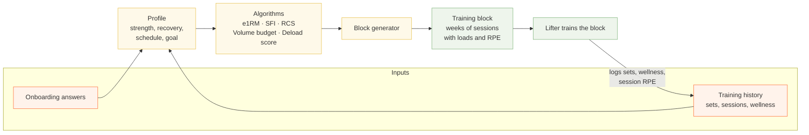
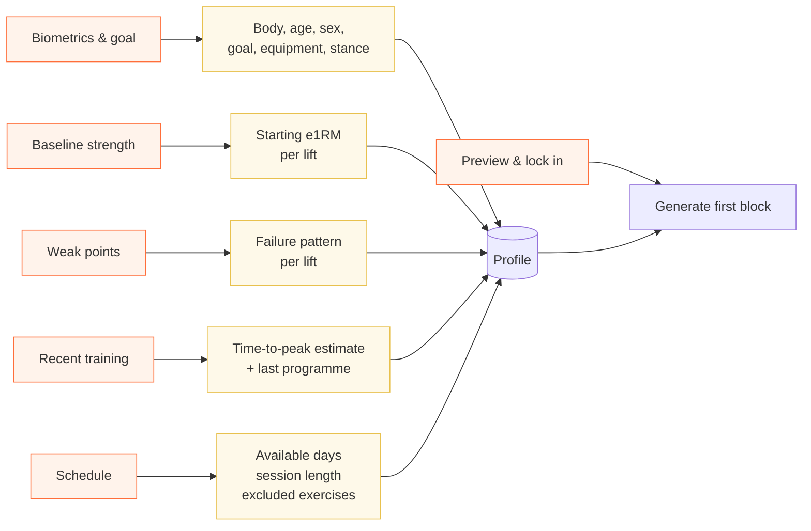
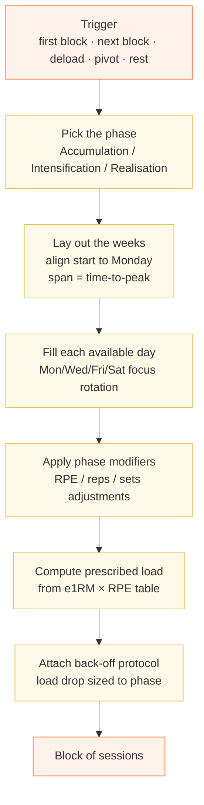
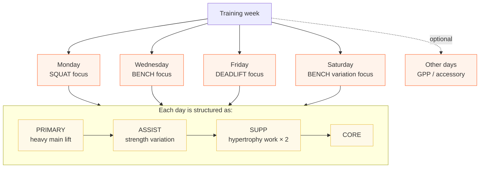
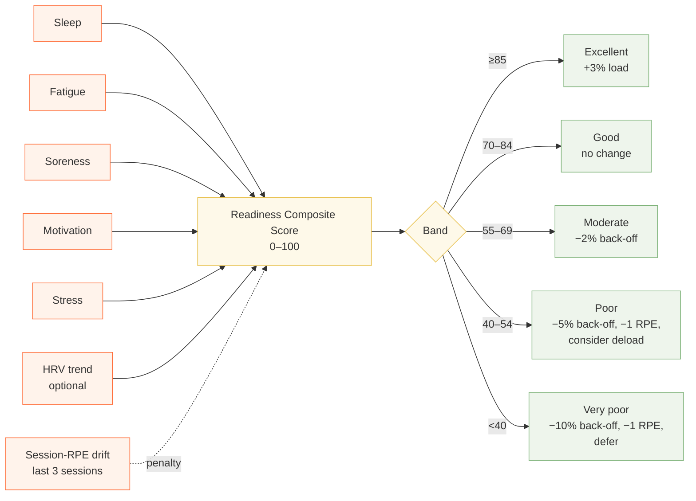
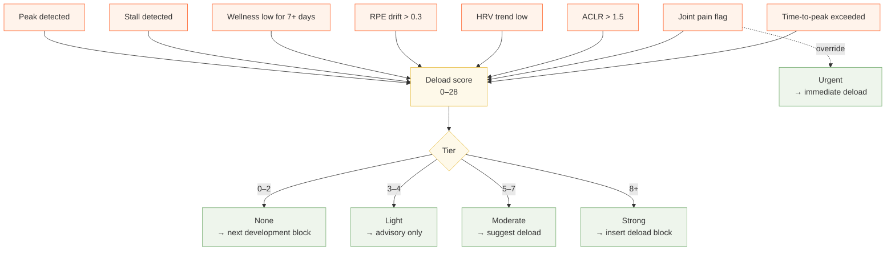
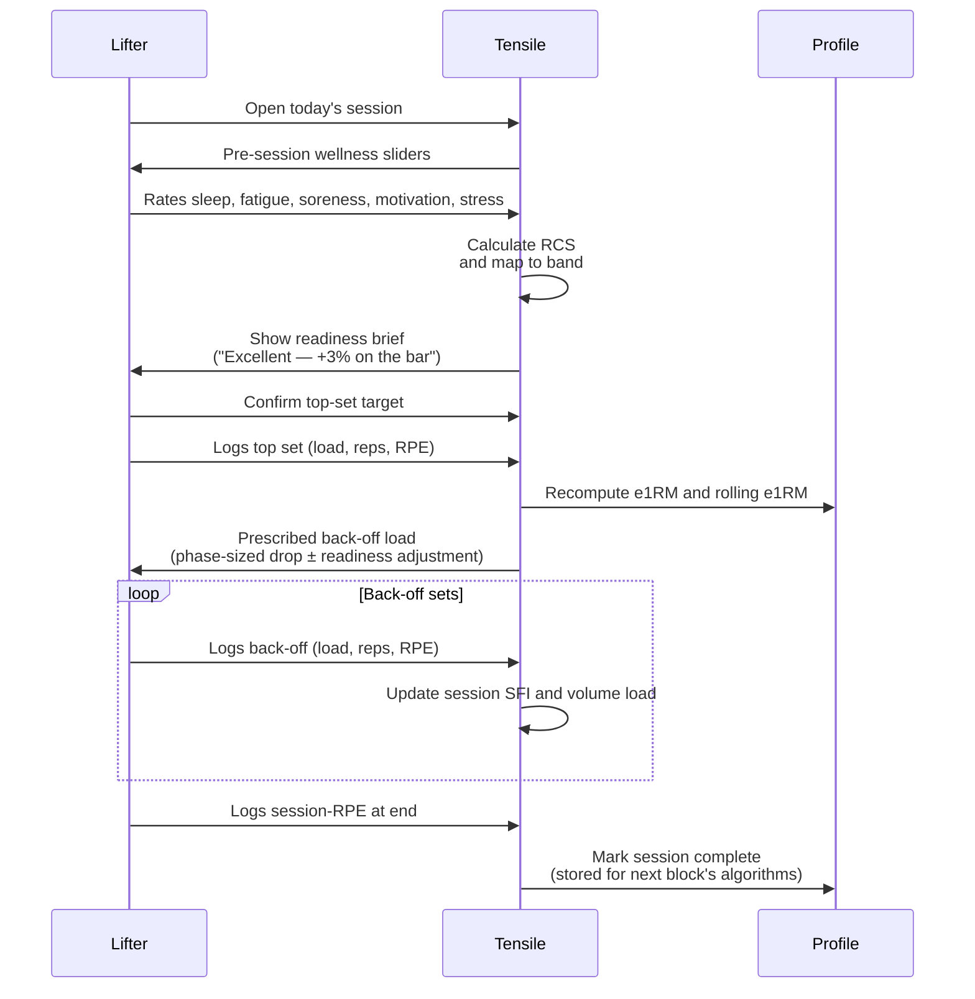
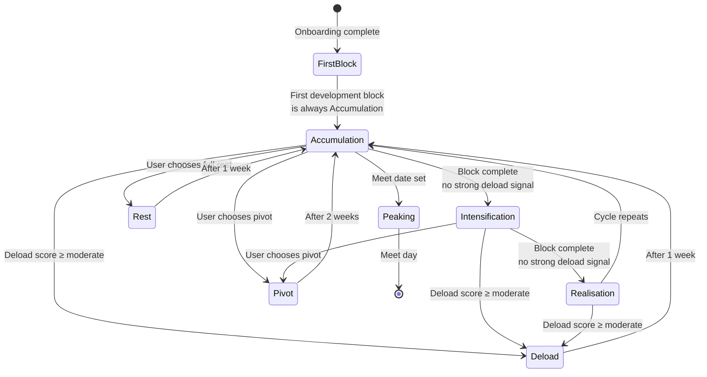

# How Tensile generates a training program

*Audience: product and coaching reviewers.*
*Scope: the full pipeline from the user's first onboarding answer to the next block the app puts in front of them.*

---

## 1. Overview

Tensile builds a training program in three stable layers that feed each other on a loop.

1. **The profile** — what the app knows about the lifter. Created during onboarding, then continuously refined by every set and every session the lifter logs.
2. **The algorithms** — a small set of fixed rules that score readiness, estimate strength, measure fatigue, and decide when to push, hold, or deload.
3. **The block generator** — composes the above into a multi-week training block of concrete sessions, each one a list of exercises with prescribed sets, reps, RPE targets, and loads.

The lifter then trains that block. Every set they log updates the profile, every wellness check updates the readiness model, and the next time a block is generated it draws on all of that new information. The program is not a fixed plan handed down once; it's the steady output of a feedback loop.

*Diagram 1 — the closed loop. Inputs feed the profile, the profile feeds the algorithms, the algorithms feed the generator, the generated block is trained, and training produces new history that updates the profile.*

---

## 2. What the user tells the app (onboarding)

Onboarding is six screens. Each one writes a specific slice of the profile, which is the only thing the generator reads later.

- **Biometrics & goal** — body weight, date of birth, sex, height, training age, primary goal (Powerlifting, Strength, Hypertrophy, General), squat stance, deadlift stance, whether they use a belt, and what they wear on their knees (raw, sleeves, wraps).
- **Baseline strength** — for squat, bench, and deadlift the lifter enters a recent heavy set as weight × reps × RPE. The app converts these into estimated one-rep maxes using the same ensemble algorithm it will use forever after, so the very first prescribed loads are already in the lifter's actual ballpark.
- **Weak points** — for each main lift, the lifter picks the failure pattern they want to fix (for example, *out of the hole* on squat, *off the chest* on bench, *off the floor* on deadlift). These are stored for use in block reviews and weak-point reporting.
- **Recent training history** — what programme they were on most recently (nSuns, Sheiko, 5/3/1, Custom RPE, etc.) and a derived time-to-peak estimate that comes from their training age (a 5+ year lifter peaks in a longer development block than a one-year lifter).
- **Schedule & equipment** — which days of the week they can train (a 7-toggle grid), how long a session should be (45, 60, 75, 90 minutes), and any exercises they want excluded (injury, no equipment, dislike).
- **First block preview** — the lifter sees the block the system will generate and locks it in.

*Diagram 2 — onboarding screens on the left, the profile fields they populate on the right. Locking in at the end triggers the first block generation.*

---

## 3. What the app remembers from training

Once the lifter is training, the app captures four kinds of data, and each one feeds back into the profile:

1. **Pre-session wellness** — five quick sliders (sleep quality, fatigue, soreness, motivation, stress). These produce a Readiness Composite Score for that session.
2. **Set logs** — for every working set: prescribed load and reps, actual load and reps, the lifter's reported RPE, optionally bar-speed velocity. The app immediately recomputes the lifter's estimated one-rep max for that lift and updates a rolling average. Every set also gets a fatigue score.
3. **Session totals** — total volume load (weight × reps across every set), total session fatigue, and a session-RPE at the end, which is the lifter's overall sense of how hard the session was.
4. **Status** — was the session completed, skipped, or partial? Any manual overrides (lower the RPE cap, drop a set, defer the session)?

The profile fields that get continuously updated by this history are:

- **Current e1RM** per lift (the latest estimate from the most recent heavy single, ensemble-weighted).
- **Rolling e1RM** per lift (an exponential moving average — recent sessions matter more, old sessions still pull on it).
- **RPE calibration** — how often the lifter logs RPE and how close their predictions match the algorithm's expectations.
- **Weekly volume** per muscle group (used against the MEV/MRV budget).
- **Wellness and fatigue trends** (used for readiness and deload decisions).

Nothing here lives on a server — the entire profile and every block lives in browser storage so the app works offline.

---

## 4. How a block is built

When the lifter is ready for a new block, the generator runs a single pass that always follows the same five steps.

*Diagram 3 — the generator's five-step pass. Every block type uses this same pipeline; the difference between a development block and a deload is in which modifiers get applied at steps 4–6.*

**Step 1 — pick the phase.** Development blocks cycle through three phases in order: Accumulation (build volume at moderate RPE), Intensification (less volume, heavier loads), Realisation (peaking with the heaviest, fewest, highest-RPE work). The generator keeps a counter of how many blocks the lifter has completed and picks the next phase by stepping through the cycle. Deload, Pivot, and Rest are separate block types with their own modifiers.

**Step 2 — lay out the weeks.** The start date is snapped to the most recent Monday so weekday-tagged sessions land on the right day. The block spans the lifter's time-to-peak estimate (default 6 weeks).

**Step 3 — fill each available day.** For every week, for every day flagged as available, the generator picks a focus and fills in the session from a fixed template — see Section 5.

**Step 4 — apply phase modifiers.** The PRIMARY lift in each session is adjusted relative to its Accumulation baseline:

| Phase            | RPE target      | Reps          | Sets          |
| ---------------- | --------------- | ------------- | ------------- |
| Accumulation     | baseline        | baseline      | baseline      |
| Intensification  | **+0.5**        | **−1**        | unchanged     |
| Realisation      | **+1.0**        | **−1**        | **−1**        |

Accessory and supplemental exercises keep the same prescription across phases; only the heavy main lift moves.

**Step 5 — compute prescribed load.** For each main lift, the generator takes the lifter's current e1RM, looks up the target reps and RPE in the Tuchscherer/Helms RPE-to-percentage table, multiplies, and rounds to the nearest 2.5 kg plate. So a 200 kg e1RM with a target of 3 reps at RPE 8.5 means 200 × 0.85 = 170 kg on the bar.

**Step 6 — attach a back-off protocol.** After the top set, the lifter does back-off sets at a fixed reduced load, repeating until their RPE rises to the prescribed RPE target. The drop size depends on the phase: 12% in Accumulation (lots of volume), 7% in Intensification, 3% in Realisation (almost no drop — the goal is heavy practice, not volume).

---

## 5. The weekly template

Every session is built from one of four day templates, plus an optional general-physical-preparation slot for any extra training days. The choice of template depends only on which weekday the session falls on.

*Diagram 4 — the four day templates and the shape of each session. Every day reuses the same PRIMARY → ASSIST → SUPP × 2 → CORE structure; only the exercises change.*

The exercises chosen for each focus are fixed:

| Focus            | PRIMARY              | ASSIST              | SUPP                              | CORE  |
| ---------------- | -------------------- | ------------------- | --------------------------------- | ----- |
| Squat            | Back squat           | Paused squat        | Romanian DL, Leg curl             | Plank |
| Bench            | Bench press          | Overhead press      | Cable row, Dumbbell curl          | Plank |
| Deadlift         | Conventional DL      | Front squat         | Barbell row, Leg extension        | Plank |
| Bench variation  | Close-grip bench     | Incline press       | Lat pulldown, Lateral raise       | Plank |

**What the tags mean:**

- **PRIMARY** — the heavy main lift for the day; the only exercise that responds to phase modifiers and the only one whose load is computed from the lifter's e1RM and the RPE table.
- **ASSIST** — a strength variation of the primary, typically lower load, more controlled, biased to a weak point.
- **SUPP** — supplemental hypertrophy work, picked to round out muscle groups not fully covered by the primary and assist.
- **CORE** — trunk work, almost always plank, always present.

The lifter can exclude individual exercises during onboarding (or anytime in their schedule), and they can add custom exercises through the catalog screen. Those custom exercises feed into the manual block editor but the auto-generator continues to use the fixed template.

---

## 6. The algorithms, explained

Each algorithm is a small, deterministic rule. There are no opaque models; every decision the app makes can be explained.

### 6.1 Ensemble e1RM — *how strong is the lifter right now?*

**What it asks:** What is the lifter's true one-rep max, given the latest heavy set they reported?

**What it uses:** Three independent estimates from the same set, weighted by how trustworthy each is for that set:

1. **Rep-based** — Epley and Brzycki formulas averaged together. Confident for low-rep, high-RPE sets; weaker for long sets where rep-prediction formulas break down.
2. **RPE-adjusted** — looks the lifter's reps + RPE combination up in a standard percentage table and divides the load by that percentage. Confidence grows as the lifter logs more sessions and their RPE predictions track closer to reality.
3. **Velocity-based** (optional) — if a bar-speed device is connected and the lifter has built up enough samples to fit a personal load-velocity profile, this becomes the most precise method.

The three estimates are blended by confidence-weighted average. The single-session estimate is then folded into a rolling average using an exponential moving average where the newest session is weighted at 30% — recent performance moves the needle quickly, but a single bad day doesn't wipe out months of progress.

**What it changes:** Every prescribed top-set load in every future session, until it's updated again.

### 6.2 RPE-to-percentage table — *how heavy is "3 reps at RPE 8.5"?*

A fixed lookup of standard published values (the Tuchscherer/Helms table) that maps every reasonable reps-at-RPE combination to a percentage of one-rep max. For example, 3 reps at RPE 8.5 is 85% of 1RM; 5 reps at RPE 9 is 82%; 1 rep at RPE 10 is 96%. This is the table used both *forwards* (to prescribe load from a target RPE and reps) and *backwards* (inside the e1RM ensemble).

### 6.3 Session Fatigue Index — *how costly was that set?*

**What it asks:** How much fatigue did this set contribute to the session?

**What it uses:** The set's RPE (higher RPE means closer to failure, more fatigue), reps (more reps means more total stress), an exercise-specific fatigue coefficient (a heavy squat at the same RPE is harder to recover from than a cable row at the same RPE), and a top-set bonus (top sets cost more than back-offs).

A rough sense of the per-exercise coefficients:

| Movement class               | Coefficient |
| ---------------------------- | ----------- |
| Heavy squat / front squat    | 1.40        |
| Conventional deadlift        | 1.35        |
| Romanian deadlift            | 1.25        |
| Overhead press               | 1.00        |
| Bench press                  | 0.95        |
| Barbell row                  | 0.85        |
| Leg press                    | 0.75        |
| Dumbbell curl                | 0.55        |
| Leg extension                | 0.50        |

**What it changes:** The session SFI is the sum across all sets, and over time the SFI trend feeds into deload detection (a sudden spike in fatigue is one of the warning signals).

### 6.4 Readiness Composite Score (RCS) — *how prepared is the lifter today?*

**What it asks:** Given how the lifter is feeling, should we lighten the day, leave it alone, or push it slightly?

**What it uses:** The five wellness sliders, weighted because sleep and fatigue matter more than motivation and stress:

| Slider          | Weight |
| --------------- | ------ |
| Sleep quality   | 1.20   |
| Overall fatigue | 1.15   |
| Muscle soreness | 1.00   |
| Motivation      | 0.85   |
| Stress          | 0.80   |

Their weighted average is normalised to 0–100. Optional HRV data can nudge the score up or down by up to ±10 points (high HRV good, low HRV bad). A creeping rise in session-RPE across the last three sessions — a sign of accumulating fatigue even if the lifter feels okay — pulls the score down by up to 15 points.

**What it changes:** The score gets mapped to a band, and each band applies prescribed adjustments to that day's session:

| Band       | RCS    | What changes                                             |
| ---------- | ------ | -------------------------------------------------------- |
| Excellent  | ≥ 85   | Top-set load +3%, back-off load +3%                      |
| Good       | 70–84  | No change                                                |
| Moderate   | 55–69  | Back-off load −2%                                        |
| Poor       | 40–54  | Back-off load −5%, RPE cap −1, *consider deload*         |
| Very poor  | < 40   | Back-off load −10%, RPE cap −1, *defer session if possible* |

*Diagram 5 — the readiness pipeline. Five sliders plus optional HRV and a fatigue-drift penalty produce a score, which lands in one of five bands, each of which prescribes a specific load and RPE adjustment for the day.*

### 6.5 Volume budget — *how many working sets per muscle group this week?*

**What it asks:** Given where we are in the block, how many working sets should each muscle group accumulate this week?

**What it uses:** A minimum effective volume (MEV) and maximum recoverable volume (MRV) per muscle group — for example, quads might be MEV 10 / MRV 22 sets per week. The week's target rises linearly from MEV in week 1 to MRV in the final week. If recovery is poor (RCS sustained low) the target shrinks by 10%; if recovery is excellent, it grows by 5% (capped just below MRV).

**What it changes:** It doesn't change the generated block directly — the template is fixed — but it shows up in the block review as a green/amber/red bar so the lifter and reviewers can see whether actual volume is tracking the budget.

### 6.6 Peak and stall detection — *is progress real, or is the lifter cooked?*

**What it asks:** Has the lifter's e1RM trend peaked (gone up, then started declining) or stalled (flatlined for several weeks)?

**What it uses:** The week-by-week best estimated 1RM across completed sessions in the current block. A peak is declared when the maximum value happened earlier in the block and the last two weeks have declined. A stall is declared after week 3 if the slope across the last three weeks is essentially flat and the lifter hasn't built more than 1% on their starting e1RM.

**What it changes:** Both feed into the deload score (see 6.7).

### 6.7 Deload score — *is it time to back off?*

**What it asks:** Should the next block be a development block, or do we need a deload first?

**What it uses:** Eight independent signals, each contributing a weight to the score:

| Signal                                | Weight | What it means                                          |
| ------------------------------------- | ------ | ------------------------------------------------------ |
| Peak detected                         | 5      | e1RM trend has clearly turned over                     |
| Joint pain flag                       | 5      | Sustained low soreness response signals an issue       |
| Stall detected                        | 4      | Strength gains have flatlined for three weeks          |
| Sustained low wellness                | 4      | Average RCS over the last 7 days is below 60           |
| Time-to-peak exceeded                 | 4      | Block has run past the lifter's TTP estimate           |
| RPE drift                             | 3      | Last 3 sessions feel ≥0.3 RPE harder than the first 3  |
| Low HRV trend                         | 2      | Optional — used if HRV data is being collected         |
| Acute-to-chronic load ratio elevated  | 1      | Recent fatigue is running >1.5× the earlier baseline   |

The weights add up to 28. The total score is mapped to a recommendation tier:

| Score    | Tier      | What the app suggests                                                  |
| -------- | --------- | ---------------------------------------------------------------------- |
| 0–2      | None      | Carry on into the next development block                               |
| 3–4      | Light     | Carry on, but the advisory is logged in the block review               |
| 5–7      | Moderate  | Suggest a deload — monitor recovery closely if the lifter declines     |
| 8+       | Strong    | Strong recommendation: insert a deload block before the next dev block |
| any score, *but joint pain on* | Urgent | Override — recommend an immediate deload regardless of score, and suggest seeing a physio |

*Diagram 6 — the deload decision. Eight signals contribute weighted points to the score; the score lands in a tier; the tier picks the next block type. The joint-pain flag is a hard override that escalates straight to "urgent" no matter what the rest of the signals say.*

---

## 7. Readiness and in-session adjustments

The block as generated is not what the lifter necessarily lifts. The readiness step happens at session start, after the block is already in place, and tweaks the day's prescription on the fly.

*Diagram 7 — one session, from arriving at the gym to walking out. The pre-session wellness check shifts the prescribed loads before the lifter touches the bar; every logged set updates the profile in place; the session-RPE at the end becomes one of the inputs to next block's deload decision.*

If the lifter wants to override anything — drop a set, lower the RPE cap, defer the session — the app records the override in the session log so reviewers can see, in the block review, how much of the block was lifted as written versus modified.

---

## 8. The block lifecycle

A Tensile lifter is always in exactly one block. Blocks come in five types, with rules for moving between them.

*Diagram 8 — the block lifecycle. Development cycles through three phases. Deload, Pivot, and Rest are detours back to Accumulation. When a meet date is set, the system schedules a Peaking phase ending on meet day.*

**First block.** Built at the moment the lifter locks in onboarding. Always starts in Accumulation.

**Development cycle.** After a block finishes, the system increments the completed-blocks counter and picks the next phase by stepping through *Accumulation → Intensification → Realisation → Accumulation → ...*. Three blocks make a full mesocycle.

**Deload block.** One week long. Built by taking what the next development block would have been, keeping only the first seven days, halving the sets on every exercise, and capping the RPE target at 7.0. Used to bleed off fatigue when the deload score crosses the moderate threshold (or immediately when the joint-pain override fires).

**Pivot block.** Two weeks long. Used when the lifter wants to shift focus or break a stall without a full deload. Built by taking the first week of the next development block, capping all RPE targets at 8.0, raising rep minimums to 6, and then duplicating that week to fill weeks one and two.

**Rest block.** One week of nothing. No sessions. Used when the lifter is sick, travelling, or just needs a complete break.

**Peaking block.** Triggered when the lifter sets a meet date. The system works backwards from the meet:

- **3 days before meet day:** Taper starts (very light openers and singles).
- **3 weeks before meet day:** Realisation starts (the last two weeks of heavy single-digit-rep work, then the taper).
- **2–3 weeks earlier still:** Pivot starts.
- **Earlier than that:** Development starts. The pivot length is roughly one third of the lifter's time-to-peak estimate, clamped between 1 and 3 weeks.

The system also reports whether the timeline is feasible (i.e. whether there is enough time between today and meet day to fit a full peak); if not, it flags the schedule and asks the lifter to either move the meet or accept a compressed plan.

---

## 9. The closed feedback loop

Pulling it all together — every logged set is also an input to the next block.

- A heavy top set logged today → the **ensemble e1RM** updates → the **rolling e1RM** drifts in the direction of recent performance → the next top set's prescribed load reflects the change.
- A streak of weeks where the e1RM trend rises, peaks, then falls → **peak detection** fires → the **deload score** rises → the next block branches to a deload instead of pushing into the next development phase.
- A run of sessions where the lifter rates them progressively harder → **session-RPE drift** is detected → the **RCS** for the next session takes a penalty → that session's prescribed back-off load drops → and the drift signal also contributes points to the **deload score**.
- A run of days where wellness scores stay low → **sustained low wellness** flag → contributes to the deload score and lowers the volume budget for that week.
- Weekly working-set counts per muscle group → tracked against the **volume budget** (MEV→MRV interpolation) → if the lifter is undershooting MEV or pushing past MRV, the block review surfaces it.

Every algorithm in Section 6 reads from the profile or session history and writes back into it. Nothing is "fire and forget" — the program the lifter sees next week is a literal function of what they did this week.

---

## 10. Glossary

| Term      | Meaning                                                                                              |
| --------- | ---------------------------------------------------------------------------------------------------- |
| **1RM**   | One-rep max — the heaviest weight the lifter could lift for a single repetition.                     |
| **e1RM**  | Estimated 1RM — what the algorithm thinks the lifter's 1RM is, computed from a sub-maximal set.      |
| **RPE**   | Rate of Perceived Exertion (6–10 scale). RPE 10 = absolute failure; RPE 8 = 2 reps left in reserve.  |
| **RIR**   | Reps in Reserve. RPE 8 ≈ 2 RIR.                                                                      |
| **sRPE**  | Session-RPE — overall hardness rating of the whole session (0–10), reported after the last set.      |
| **TTP**   | Time-to-Peak — how many weeks the lifter takes to peak in a development block.                       |
| **MEV**   | Minimum Effective Volume — fewest weekly working sets per muscle group that still drives gains.      |
| **MRV**   | Maximum Recoverable Volume — most weekly sets a muscle group can take and still recover.             |
| **RCS**   | Readiness Composite Score (0–100) — daily readiness used to adjust the session.                      |
| **SFI**   | Session Fatigue Index — running total of fatigue cost across all sets in a session.                  |
| **EFC**   | Exercise Fatigue Coefficient — per-exercise multiplier inside the SFI calculation.                   |
| **ACLR**  | Acute-to-Chronic Load Ratio — recent fatigue load divided by longer-term fatigue load.               |
| **HRV**   | Heart Rate Variability — autonomic recovery signal; optional input to the RCS.                       |

---

## Appendix — Where this lives in the code

For engineers who want to look at the implementation, every section above maps to specific files. Tensile is a TypeScript + React app under `tensile-app/`. State lives in a single Zustand store and is persisted to browser localStorage; there is no backend.

| Doc section                              | Source file(s)                                                                                                                                  |
| ---------------------------------------- | ----------------------------------------------------------------------------------------------------------------------------------------------- |
| Profile shape (§2, §3)                   | `tensile-app/src/store.ts` — `UserProfile`                                                                                                      |
| Onboarding screens (§2)                  | `tensile-app/src/screens/onboarding/` (Welcome, Biometrics, Baselines, WeakPoint, History, Schedule, FirstBlock)                                |
| Per-session logging (§3, §7)             | `tensile-app/src/screens/session/` (Wellness, ReadinessBrief, TopSet, DropProtocol, Summary) + `logSet` / `completeSession` in `store.ts`       |
| Block generator pipeline (§4)            | `tensile-app/src/store.ts` — `generateBlock`, `generateFirstBlock`, `generateNextDevelopmentBlock`, `generateDeloadBlock`, `generatePivotBlock` |
| Weekly day templates (§5)                | `tensile-app/src/store.ts` — `createDayPlan`                                                                                                    |
| Exercise catalog (§5)                    | `tensile-app/src/exerciseCatalog.ts`                                                                                                            |
| Ensemble e1RM (§6.1)                     | `tensile-app/src/engine.ts` — `calculateE1RM`, `ensembleE1RM`                                                                                    |
| RPE → % table (§6.2)                     | `tensile-app/src/engine.ts` — `DEFAULT_RPE_TABLE`, `getRpePct`                                                                                    |
| Session Fatigue Index (§6.3)             | `tensile-app/src/engine.ts` — `calculateSetSFI`, `calculateSessionSFI`                                                                          |
| Readiness Composite Score (§6.4, §7)     | `tensile-app/src/engine.ts` — `calculateRCS`, `rcsBand`                                                                                          |
| Volume budget (§6.5)                     | `tensile-app/src/engine.ts` — `volumeBudget`; visualised in `screens/block/Volume.tsx`                                                          |
| Peak / stall detection (§6.6)            | `tensile-app/src/engine.ts` — `detectPeak`, `detectStall`                                                                                        |
| Deload score (§6.7)                      | `tensile-app/src/engine.ts` — `calculateDeloadScore`, `deloadRecommendation`; signal computation in `screens/deload/DeloadRec.tsx`              |
| Phase modifiers and back-off drops (§4)  | `tensile-app/src/store.ts` — `createDayPlan` (RPE/reps/sets); `tensile-app/src/engine.ts` — `getBackOffDrop`                                     |
| Peaking timeline (§8)                    | `tensile-app/src/engine.ts` — `generatePeakingPlan`; UI in `screens/meet/Peaking.tsx`                                                            |
| Block lifecycle (§8)                     | `tensile-app/src/store.ts` — block generator wrappers; `screens/block/NextBlock.tsx` triggers the transition                                     |
